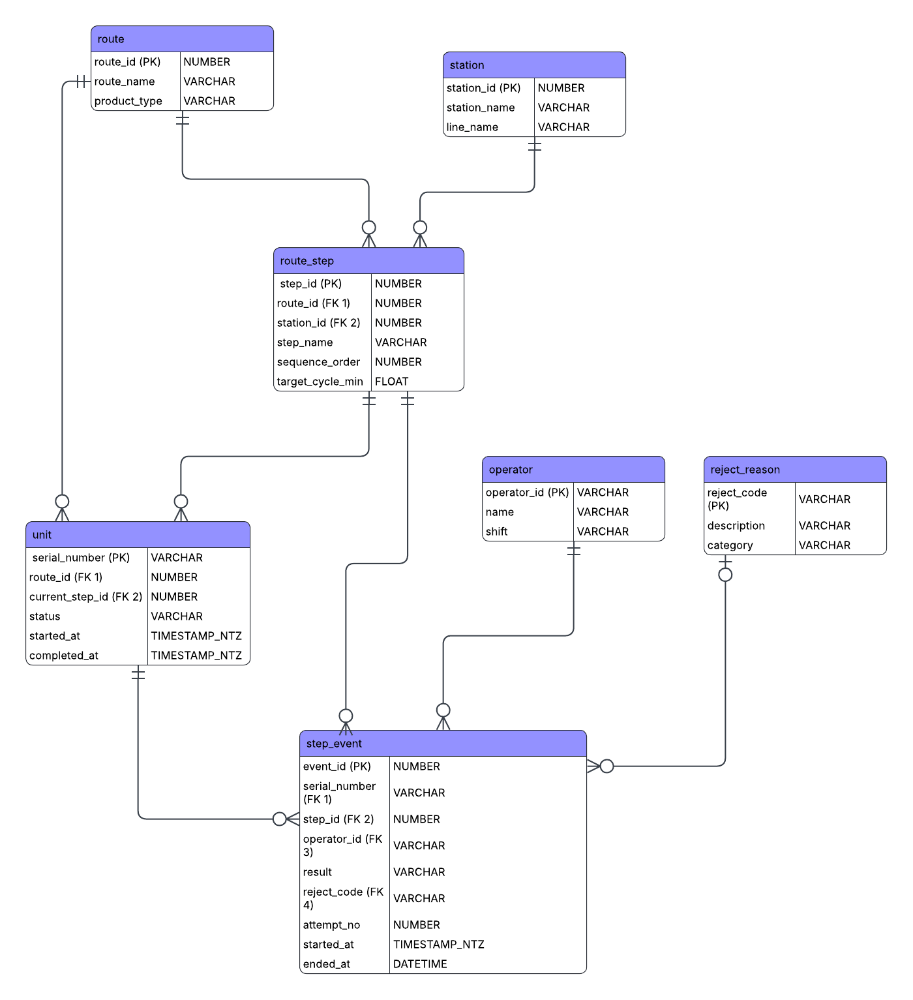

# Sigma Live — Track 4 (Mini-MES)

A take-home technical assignment for Veeco Instruments' Sigma Live Ecosystem Challenge. The goal: build a miniature version of the Snowflake + Sigma Computing pattern — an operational input surface and a live analytics dashboard, connected so that a submission in one instantly changes what the other shows.

**Track 4 scenario:** real-time visibility for operators routing high-value assets through assembly and test steps in a manufacturing execution system (MES).

Both components are built inside real Sigma Computing on a real Snowflake trial account — not simulated locally, not a mock dashboard.

**Sigma Live Insight** is a live dashboard showing First-Pass Yield (FPY) per step, Rolled Throughput Yield (RTY), cycle time vs. target, WIP by step, and a reject Pareto. Every chart queries Snowflake directly — a refresh always reflects the current state of the data.

**Sigma Live Action** is a digital traveler form where a technician picks a serial number, test step, operator, and PASS/FAIL result. Submitting calls a Snowflake stored procedure (`sp_insert_step_event`) that validates the input and inserts directly into `step_event` — the same table Insight reads from. That is what closes the write-back loop.

## Live Workbook

Both components live in the same Sigma workbook on separate pages. Navigate between them using the page tabs at the bottom of the Sigma interface.

| Component | Page | Link |
|---|---|---|
| Sigma Live Insight | Page 1 | [Open Sigma Live Insight](https://app.sigmacomputing.com/mes-test/workbook/Sigma-Live-Insight-2YbIGrEf6CNqXsqlbTxJvQ/edit?:nodeId=TP-9xAGJQ4) |
| Sigma Live Action | Action | [Open Sigma Live Action](https://app.sigmacomputing.com/mes-test/workbook/Sigma-Live-Insight-2YbIGrEf6CNqXsqlbTxJvQ/edit?:nodeId=fJq8WIyk0c) |

## Kanban Board
Created and updated a Kanban board on Trello to track progress over the assignment. Link for the Kanban board: (https://trello.com/b/Zwfdnx7k/sigma-live-mes) 

## Technical Architecture


A technician submits a test result through Sigma Live Action. The Submit button calls `sp_insert_step_event` — a Snowflake stored procedure that resolves the step name to a numeric ID, validates the PASS/FAIL and reject code relationship, computes the correct `attempt_no`, and inserts directly into `step_event`. Sigma Live Insight queries that same table on every refresh through four pre-built analytics views. There is no intermediate Input Table, no union view, and no batch ETL. One procedure call, one table insert, one source of truth.
## Database Design



7 tables, all normalized so nothing has to be free-typed twice: `route`, `station`, `operator`, `reject_reason`, `route_step`, `unit`, `step_event`.

**route** — contains the header record of the manufacturing route. One row per process defined (e.g., "Widget Assembly A Route"). Contains fields `route_name` and `product_type`. This is the object that the unit is built against.

**station** — physical locations of stations in the facility (`station_name`, `line_name`). Allows the step event to reference an actual location instead of a string entry that can be spelled inconsistently each time.

**route_step** — the ordered template of the route steps. One row per step, containing `step_name`, `sequence_order` (1, 2, 3...), `station_id`, and `target_cycle_min` (expected time). Remains static through the course of production operations.

**operator** — contains the technicians (`operator_id` such as 'OP-001', `name`, `shift`). Provides a way for the step event to reference an actual operator rather than a free-typed name.

**reject_reason** — the list of failure codes (`reject_code`, `description`, `category`). The technician picks from this list on a fail — no free typing allowed, which is what makes the Pareto chart on the Insight side trustworthy.

**unit** — the actual physical object being serialized in the factory. PK is `serial_number`. Includes which route it belongs to, its current status (`IN_PROCESS`, `PASSED`, `SCRAPPED`, `ON_HOLD`), and `current_step_id` — a pointer to its current position that enables the WIP/bottleneck view.

**step_event** — the transactional core and the write-back target. Every test performed by a technician lands here: `serial_number`, `step_id`, `operator_id`, `result`, `reject_code` (on a fail), `attempt_no`, and start/end timestamps. Nothing is ever removed or updated — append-only, so every KPI is a pure function of event history.

## FPY and RTY — the math

First-Pass Yield per step counts only `attempt_no = 1` rows. A retry does not count toward the numerator — that is the correct definition of first-pass, not a design simplification.

RTY = FPY(Mechanical assembly) × FPY(Functional test) × FPY(Final inspection)

Snowflake has no native PRODUCT() aggregate. RTY is a calculated field in Sigma Live Insight using `Exp(Sum(Ln([fpy])))`. Verified baseline with the 28-row seed dataset: Mechanical assembly 0.8182 · Functional test 0.8571 · Final inspection 0.8333 · RTY 0.58.

## Validation — what the stored procedure enforces

Snowflake declares CHECK and FOREIGN KEY constraints in the DDL for documentation purposes but does not enforce either at insert time on standard tables. The stored procedure is the real enforcement layer: it resolves step_name to a numeric step_id, rejects FAIL with no reject_code, rejects PASS with a reject_code present, computes attempt_no dynamically, and returns a human-readable OK or ERROR string that Sigma Live Action displays in the Result Message field immediately after submission.

## Repository structure

```text
VEECO_ASSIGNMENT_TRACK4/
├── Data/
│   ├── 00_setup.sql               # Warehouse, database, schema creation
│   ├── 01_schema.sql              # DDL: 7 tables, format-validated keys, indexes
│   ├── 02_seed_data.sql           # Demo data: 1 route, 15 units, 28 step events
│   ├── 03_views.sql               # 4 analytics views (FPY, cycle time, WIP, rejects)
│   ├── 04_sigma_service_user.sql  # Key-pair auth service user setup
│   └── 05_storedprocedure.sql     # Write-back stored procedure + grants
├── Docs/
│   └── Images/
│       ├── Database_ER_diagram_1.png   # Entity-relationship diagram
│       └── System_Architecture.png     # System architecture diagram
├── Reports/
│   ├── Sigma Live Action.pdf      # Exported view of the Action page
│   └── Sigma Live Insight.pdf     # Exported view of the Insight dashboard
├── .gitignore
└── README.md
```

## Snowflake setup from scratch

Run the files in `Data/` in numbered order in Snowflake Workspaces. Each file sets its own session context since Workspaces sessions do not share context across files.

1. `00_setup.sql` — creates the warehouse, database, and schema
2. `01_schema.sql` — creates all 7 tables with format-validated keys and indexes
3. `02_seed_data.sql` — loads 1 route, 15 units, 28 step events
4. `03_views.sql` — creates the 4 analytics views Insight reads from
5. `04_sigma_service_user.sql` — creates the key-pair service user. Required because Snowflake began enforcing MFA for all password-based logins from mid-2026. A TYPE=SERVICE user authenticated by RSA key-pair is exempt from that policy since it never uses a password.
6. `05_storedprocedure.sql` — creates `sp_insert_step_event` and grants INSERT on `step_event` and USAGE on the procedure to the service role
7. Connect Sigma to Snowflake using the service user credentials (key-pair auth, not password), with write access enabled pointing at `SIGMA_LIVE_MES.SIGMA_WRITEBACK`
8. Open the workbook — both components are immediately usable

## AI-assisted development workflow

This project was built with Claude code as the primary AI pairing tool, used to verify schema design, check stored procedure logic, help in SQL porting, format architecture documentation, and Git commit strategy. Also, claude code was used to come up with testing strategy for the final product.

## Status

- [x] Architecture and data model documented
- [x] Kanban board with full milestone breakdown
- [x] Snowflake database setup — schema, views, seed data verified on real account
- [x] Sigma service user with key-pair auth — resolves Snowflake MFA enforcement
- [x] Sigma Live Insight — FPY, RTY, cycle time, WIP, reject Pareto — verified against hand-calculated baseline
- [x] Sigma Live Action — stored procedure write-back, validated end-to-end with live submissions
- [x] Result Message display — shows OK or ERROR string on every submission
- [x] Validation enforced in procedure — PASS+reject_code and FAIL+no-reject_code both caught and surfaced to the user
- [x] Validated the final SIGMA insight dashboard with Edge cases 
