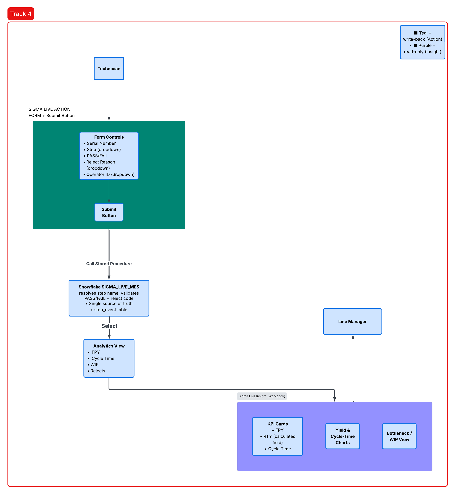

# Sigma Live — Track 4 (Mini-MES)

A take-home technical assignment for Veeco Instruments' Sigma Live Ecosystem
Challenge. The goal: build a miniature version of the Snowflake + Sigma Computing
pattern — an operational input surface and a live analytics dashboard, connected
so that a submission in one instantly changes what the other shows.

**Track 4 scenario:** real-time visibility for operators routing high-value assets
through assembly and test steps in a manufacturing execution system (MES).

**Two components:**
- **Sigma Live Action** — where a technician logs a serial number, test step, and
  PASS/FAIL result.
- **Sigma Live Insight** — a live dashboard showing First-Pass Yield, cycle time,
  and the current line bottleneck.

Both are built on real Snowflake and Sigma Computing trial accounts, not simulated
locally.

---

## Technical Architecture

.png)

A technician submits a test result through Sigma Live Action. That write lands in
Snowflake, the single source of truth both components read from and write to.
Sigma Live Insight queries Snowflake directly and re-renders on refresh — so a new
submission is reflected in the dashboard's yield, cycle time, and bottleneck numbers
without any manual sync step.

---

## Database Design

7 tables, all normalized so nothing has to be free-typed twice: `route`, `station`,
`operator`, `reject_reason`, `route_step`, `unit`, `step_event`.

**route** — contains the header record of the manufacturing route. Contains one row per process defined (e.g., "Widget Assembly A Route"). Contains fields `route_name` and `product_type`. This is the object that the unit is built against.

**station** — physical locations of stations in the facility (`station_name`, `line_name`). Allows the step event to reference an actual location instead of a string entry that can be spelled inconsistently each time.

**route_step** — contains the ordered template of the route steps. Contains one row per step, containing information about the `step_name`, `sequence_order` (1, 2, 3...), `station_id` (where the step takes place), and `target_cycle_min` (expected time). The `route_step` table remains static through the course of production operations.

**operator** — contains the technicians (`operator_id` such as 'OP-001', `name`, `shift`). Like the station table, this provides a way for the step event to reference an actual operator.

**reject_reason** — the list of failure codes used to describe why a unit is being rejected (`reject_code`, `description`, `category`). This is the list from which a technician chooses while flagging a unit fail — no free typing allowed here, hence the trustworthiness of the Pareto chart on the Insight side.

**unit** — the actual physical object being serialized in the factory. PK is `serial_number` (no surrogate ID, because we need uniqueness here). It includes data about which route it belongs to, its current status (`IN_PROCESS`, `PASSED`, `SCRAPPED`, `ON_HOLD`), and importantly, `current_step_id` — a pointer to its current position. This one column enables the WIP/bottleneck view.

**step_event** — the transactional core. Each and every test performed by a technician is recorded here: for which `serial_number`, which `step_id`, which `operator_id`, `result`, `reject_code` (in case of a fail), `attempt_no` (first time or repeat?), and start/end timestamps. Nothing is ever removed or updated here; all operations can be done concurrently.

---

## Status

- [x] Architecture & database design
- [x] Snowflake database (schema, views, seed data)
- [ ] Sigma Live Insight workbook
- [ ] Sigma Live Action input table + write-back